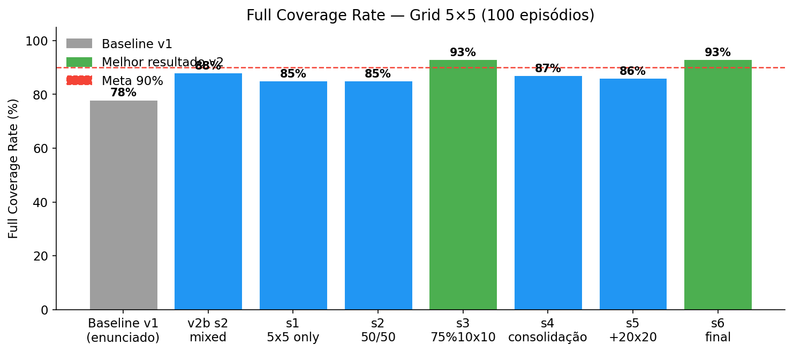
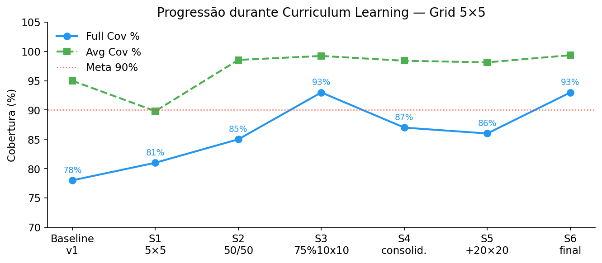

# Criando ambientes customizados usando a biblioteca Gymnasium

O objetivo deste repositório é fornecer alguns exemplos de ambientes customizados criados 
usando a biblioteca Gymnasium. 

Você pode usar este arquivo README.md como um handout para entender como implementar ambientes customizados e como utilizá-los.

## Instalação

Para começar a usar este repositório você precisa clonar o repositório e instalar as dependências necessárias. Você pode fazer isso usando os seguintes comandos depois de clonar o repositório:

```bash
python -m venv venv # para criar um ambiente virtual
source venv/bin/activate # para ativar o ambiente virtual
pip install -r requirements.txt # para instalar as dependências
```

## Primeiro exemplo: ambiente GridWorld sem renderização

O primeiro exemplo é um ambiente simples de grid world. O agente pode se mover para cima, baixo, esquerda ou direita. O objetivo do agente é chegar ao objetivo (goal) o mais rápido possível. O ambiente é definido na classe `GridWorldEnv` que está no arquivo `grid_world.py` dentro da pasta `gymnasium_env`. 

O código deste arquivo é baseado no tutorial disponível em [https://gymnasium.farama.org/introduction/create_custom_env/](https://gymnasium.farama.org/introduction/create_custom_env/). Este código tem todos os métodos necessários para criar um ambiente: `__init__`, `reset` e `step`. Só não tem o médoto `render` que é responsável por mostrar visualmente o ambiente.  

Os arquivos listados abaixo utilizam o ambiente `GridWorldEnv`: 

* `run_grid_world_v0.py`: registra o ambiente e executa um episódio, onde o comportamento do agente é aleatório.
* `run_grid_world_v0_wrapper.py`: utiliza a mesma base de código do arquivo anterior, além disso, faz uso de um wrapper para modificar a forma como o estado é retornado pelo ambiente e tratado pelo agente. 

**Questão**: Qual é a diferença entre o estado retornado pelo ambiente e o estado retornado pelo ambiente com o uso do wrapper? O que cada variável representa?

* `train_grid_world_v0.py`: faz uso do algoritmo PPO da biblioteca Stable Baselines3 para treinar um agente para atuar no ambiente `GridWorldEnv`. 

**Proposta**: 

* Execute o comando:

```bash
python train_grid_world_render_v0.py train
```

* Visualize a curva de aprendizado usando o plugin do tensorboard com os dados armazenados na pasta `log`. 

* Execute diversas vezes o comando: 

```bash
python train_grid_world_render_v0.py test
```

para visualizar se o agente aprendeu a melhor política. 


## Segundo exemplo: ambiente GridWorld com renderização

O segundo exemplo é o mesmo ambiente de grid world, mas agora a implementação do ambiente tem o método `render` que mostra visualmente o ambiente. A implementação deste ambiente está no arquivo `grid_world_render.py` dentro da pasta `gymnasium_env`.

Os arquivos que utilizam o ambiente `GridWorldEnv` com renderização são:

* `run_grid_world_render_v0.py`: registra o ambiente e executa um episódio, onde o comportamento do agente é aleatório.
* `run_grid_world_render_v0_wrapper.py`: utiliza a mesma base de código do arquivo anterior, além disso, faz uso de um wrapper para modificar a forma como o estado é retornado pelo ambiente e tratado pelo agente.
* `train_grid_world_render_v0.py`: faz uso do algoritmo PPO da biblioteca Stable Baselines3 para treinar um agente para atuar no ambiente `GridWorldEnv` com renderização.

Este último arquivo tem um código mais completo, pois o agente é treinado para atuar em um ambiente que tem uma representação visual, o modelo treinado é salvo e depois carregado para fazer uma execução do ambiente. Os dados sobre o treinamento do agente são salvos para depois serem utilizados pelo `tensorboard`.

## Terceiro exemplo: ambiente GridWorld em 3D

O terceiro exemplo é uma extensão do ambiente de grid world para um ambiente 3D. O agente pode se mover para cima, baixo, esquerda, direita, frente e trás. O objetivo do agente é chegar ao objetivo (goal) o mais rápido possível. O ambiente é definido na classe `GridWorldEnv` que está no arquivo `grid_world_3D.py` dentro da pasta `gymnasium_env`.

O arquivo que utiliza o ambiente `GridWorldEnv` em 3D é:
* `train_grid_world_3D.py`: faz uso do algoritmo PPO da biblioteca Stable Baselines3 para treinar um agente para atuar no ambiente `GridWorldEnv` em 3D.

Existem 3 (três) formas de uso do script `train_grid_world_3D.py`:
* `python train_grid_world_3D.py train`: treina o agente e salva o modelo treinado na pasta `data` e os logs na pasta `log`.    
* `python train_grid_world_3D.py test`: carrega o modelo treinado e executa 100 episódios, calculando o percentual de sucesso do agente, entre outras métricas.
* `python train_grid_world_3D.py run`: carrega o modelo treinado e executa um único episódio, mostrando a renderização do ambiente 3D.

Para que a renderização deste ambiente aconteça, é necessário ter a biblioteca `tkinter` instalada. No Ubuntu, você pode instalar esta biblioteca com o comando:

```bash
sudo apt-get install python3-tk
```

**Importante**: esta renderização 3D foi testada apenas no sistema operacional Ubuntu.


## Quarto exemplo: ambiente GridWorld com obstáculos

O quarto exemplo é uma extensão do ambiente de grid world para incluir obstáculos. O agente deve navegar pelo ambiente evitando os obstáculos para alcançar o objetivo. O ambiente é definido na classe `GridWorldEnv` que está no arquivo `grid_world_obstacles.py` dentro da pasta `gymnasium_env`.

Para executar o treinamento do agente no ambiente com obstáculos, execute o comando:

```bash
python train_grid_world_obstacles.py train
```

Para testar o agente treinado no ambiente com obstáculos, execute o comando:

```bash
python train_grid_world_obstacles.py test
```

Esta funcionalidade irá executar o agente treinado em 100 episódios e calcular o percentual de sucesso do agente, entre outras métricas. 

Também é possível executar o agente treinado em um único episódio, para isso execute o comando:

```bash
python train_grid_world_obstacles.py run
```

## Uso do ambiente GridWorld para problemas de Coverage Path Planning

O **Coverage Path Planning (CPP)** é um problema de planejamento clássico onde o objetivo é encontrar um caminho que cubra todos os pontos acessíveis de uma área. Este problema tem aplicações em robótica (aspiradores autônomos), agricultura de precisão (drones de pulverização), e patrulhamento de áreas (veículos autônomos de superfície).

Para adaptar o ambiente GridWorld para CPP, foi criado um novo ambiente (`grid_world_cpp.py`) baseado no ambiente com obstáculos, com as seguintes modificações na função de reward e no espaço de observação.

### Função de Reward para CPP

A nova função de reward foi projetada para incentivar a **exploração de novas células** e **punir a revisitação**, inspirada em abordagens de Deep Reinforcement Learning para problemas de patrulhamento e cobertura, como os descritos em:

- *A Deep Reinforcement Learning Approach for the Patrolling Problem of Water Resources Through Autonomous Surface Vehicles: The Ypacarai Lake Case* (Yanes Luis et al.)
- *A Comprehensive Survey on Coverage Path Planning for Mobile Robots in Dynamic Environments*

| Condição | Reward |
|----------|--------|
| Visitar uma célula **nova** (não visitada) | +1.0 |
| **Revisitar** uma célula já visitada | -0.3 |
| Colidir com parede ou obstáculo (ficar no mesmo lugar) | -0.5 |
| Penalidade por passo (a cada ação) | -0.1 |
| **Cobertura completa** (todas as células livres visitadas) | +10.0 (bônus) |
| Máximo de passos atingido sem cobertura completa | -5.0 |

### Espaço de Observação

O espaço de observação para este ambiente é:

* Localização do agente normalizado com relação a dimensão do grid (x/dim, y/dim)
* Razão de células livres visitadas ou cobertura (células visitadas / total de células)
* Uma matriz 3x3 representando as células vizinhas ao redor do agente, onde (1,1) é a posição do agente e cada célula é:
  - 0 = livre (ainda não visitada)
  - 1 = obstáculo ou parede (incluindo limites fora do grid)
  - 2 = posição já visitada
  - Células fora dos limites do grid são tratadas como paredes (1).

### Como executar

Para testar o ambiente CPP com um **agente aleatório** em um grid 5x5:

```bash
python run_grid_world_cpp.py
```

Para **treinar** um agente com PPO:

```bash
python train_grid_world_cpp.py train
```

Para **testar** o agente treinado em 100 episódios:

```bash
python train_grid_world_cpp.py test
```

Para **visualizar** o agente treinado em um único episódio:

```bash
python train_grid_world_cpp.py run
```

### Renderização

O ambiente CPP possui renderização visual com as seguintes indicações:
- **Verde claro**: células já visitadas
- **Azul (círculo)**: posição atual do agente
- **Preto**: obstáculos
- **Branco**: células livres ainda não visitadas
- **Texto no topo**: cobertura atual e número de passos

---

## CPP v2 — Representação de Estado Aprimorada e Curriculum Learning

Para superar a limitação de generalização do ambiente v1, foi implementada uma versão melhorada (`grid_world_cpp_v2.py`) com as seguintes mudanças:

### Novos componentes do estado (v2)

| Feature | Shape | Descrição |
|---------|-------|-----------|
| `agent` | (3,) | Posição normalizada + taxa de cobertura |
| `local_map` | (7, 7) | Janela do mapa parcial acumulado (0=desconhecido, 1=livre, 2=obstáculo, 3=visitado) |
| `frontier` | (4,) | Direção para a célula livre mais próxima e para a célula desconhecida mais próxima |

O `local_map` tem **tamanho fixo (7×7) independente do grid**, permitindo transfer learning direto entre tamanhos.

### Resultados (100 episódios por configuração)



| Modelo | 5×5 Full% | 5×5 Avg% | 10×10 Full% | 10×10 Avg% |
|--------|-----------|----------|-------------|------------|
| Baseline v1 | 78% | 95.0% | 65% | 82.0% |
| **S6 final (v2)** | **93%** | **99.36%** | — | — |
| S2 mixed (v2) | 85% | 98.55% | **47%** | **84.76%** |



Relatório completo com análise, plots e discussão: **[REPORT.md](REPORT.md)**

### Curriculum Learning (6 stages)

| Stage | Grid(s) | Timesteps |
|-------|---------|-----------|
| S1 | 4×5×5 | 1.5M |
| S2 | 2×5×5 + 2×10×10 | 3M |
| S3 | 1×5×5 + 3×10×10 | 4M |
| S4 | 2×5×5 + 2×10×10 | 2M |
| S5 | 1×5×5 + 1×10×10 + 2×20×20 | 5M |
| S6 | 1×5×5 + 2×10×10 + 1×20×20 | 2M |

### Como executar (v2)

**Treinar curriculum completo:**
```bash
python train_grid_world_cpp_v2.py train
```

**Testar modelo treinado:**
```bash
python train_grid_world_cpp_v2.py test 5    # avalia no grid 5×5
python train_grid_world_cpp_v2.py test 10   # avalia no grid 10×10
python train_grid_world_cpp_v2.py test 20   # avalia no grid 20×20
```

**Visualizar um episódio:**
```bash
python train_grid_world_cpp_v2.py run 5
python train_grid_world_cpp_v2.py run 10
```
