# Relatório — Coverage Path Planning com Curriculum Learning e Representação de Estado Aprimorada

**Disciplina:** Reinforcement Learning  
**Aluno:** Yuri Tabacof  
**Data:** 08/05/2026

---

## 1. Introdução

O problema de **Coverage Path Planning (CPP)** consiste em encontrar uma trajetória que cubra todos os pontos acessíveis de um ambiente. O agente deve visitar todas as células livres de um grid NxN com obstáculos usando apenas **observação parcial** — ele não vê o mapa completo, apenas uma janela 3×3 ao redor de sua posição.

Este relatório documenta a jornada de melhoria do agente: parte de um baseline com 78% de cobertura completa no 5×5, passa por diagnóstico do problema, novas arquiteturas de estado, curriculum learning e chega a 90% no 5×5 e **93.85% de cobertura média no 10×10**.

---

## 2. O Problema: Por Que o Agente v1 Trava

O baseline (v1) atingia ~78% de full coverage no 5×5 e ~65% no 10×10. A causa foi identificada na representação do estado:

| Feature v1 | Problema |
|------------|---------|
| Posição normalizada `(x/size, y/size)` | Informa localização, não direção para áreas inexploradas |
| Taxa de cobertura global | Útil, mas sem informação espacial |
| Vizinhança 3×3 instantânea | **Sem memória** — quando todas as células vizinhas estão visitadas, a observação é idêntica independente de onde estão as células não-visitadas no grid |

O agente v1 ficava preso em loops: sem memória de onde já esteve, ele não sabia para onde navegar quando toda a vizinhança imediata já estava coberta. Em grids maiores, isso se agravava — havia mais distância para percorrer até a próxima célula nova, e o agente não tinha como inferir a direção certa.

---

## 3. A Solução: Ambiente v2 + Curriculum Learning

### 3.1 Representação de Estado Aprimorada

Três mudanças no espaço de observação resolvem o problema de memória:

**`seen_map` — memória de exploração persistente**

Um mapa interno `(size × size)` acumulado ao longo do episódio via vizinhança 3×3 do agente a cada passo:

| Valor | Significado |
|-------|------------|
| 0 | Desconhecido (nunca na janela do agente) |
| 1 | Livre e não visitado |
| 2 | Obstáculo ou parede |
| 3 | Visitado pelo agente |

**`local_map` 7×7 — contexto espacial ampliado**

Janela centrada no agente extraída do `seen_map`. Tem **tamanho fixo** independente do grid — essencial para usar o mesmo modelo em grids de tamanhos diferentes via transfer learning.

**`frontier` vector — guia explícito de navegação**

`[dx_livre, dy_livre, dx_desconhecido, dy_desconhecido]` aponta para a célula livre mais próxima e para a célula desconhecida mais próxima. Este sinal resolve diretamente o travamento: mesmo quando toda a vizinhança imediata está visitada, o agente sabe em que direção ir.

```
observation = {
  "agent":     Box(3,)    # [x/(size-1), y/(size-1), coverage_ratio]
  "local_map": Box(7, 7)  # janela do seen_map normalizada
  "frontier":  Box(4,)    # [dx_free, dy_free, dx_unknown, dy_unknown]
}
```

### 3.2 Primeira Tentativa de Curriculum — e o Problema do Catastrophic Forgetting

Com o novo ambiente v2, o primeiro experimento treinou sequencialmente: stage 1 em 5×5 (1.5M steps) → stage 2 em 10×10 puro (2M steps).

Resultado: **catastrophic forgetting grave**.

| Modelo | 5×5 Full% | 10×10 Full% |
|--------|-----------|-------------|
| Stage 1 | 81% | 1% (zero-shot) |
| Stage 2 | **0%** | 53% |

Após fine-tuning puro em 10×10, o agente simplesmente "esqueceu" o 5×5 — de 81% para 0%. O gradiente da tarefa 5×5 desapareceu completamente após 2M passos treinando só em 10×10.

### 3.3 Curriculum Misto — A Solução

A correção foi treinar ambos os grids **simultaneamente** via DummyVecEnv com 4 envs paralelos divididos entre tamanhos. Sem regularização extra, apenas misturando os dados de treino.

O curriculum completo evoluiu em 6 stages:

| Stage | Mix de envs | Timesteps | LR | ent | Objetivo |
|-------|------------|-----------|-----|-----|---------|
| S1 | 4×5×5 | 1.5M | 3×10⁻⁴ | 0.05 | Aprender CPP básico |
| S2 | 2×5×5 + 2×10×10 | 3M | 1×10⁻⁴ | 0.03 | Introduzir 10×10 sem esquecer 5×5 |
| S3 | 1×5×5 + 3×10×10 | 4M | 1×10⁻⁴ | 0.08 | Foco 10×10, alta entropia quebra loops |
| S4 | 2×5×5 + 2×10×10 | 2M | 3×10⁻⁵ | 0.03 | Consolidação, LR reduzido |
| S5 | 1×5×5 + 1×10×10 + 2×20×20 | 5M | 1×10⁻⁴ | 0.05 | Introdução 20×20 |
| S6 | 1×5×5 + 2×10×10 + 1×20×20 | 2M | 2×10⁻⁵ | 0.02 | Ajuste fino final |

---

## 4. Resultados — Fase 1 (S1→S6)

### 4.1 Progressão no 5×5

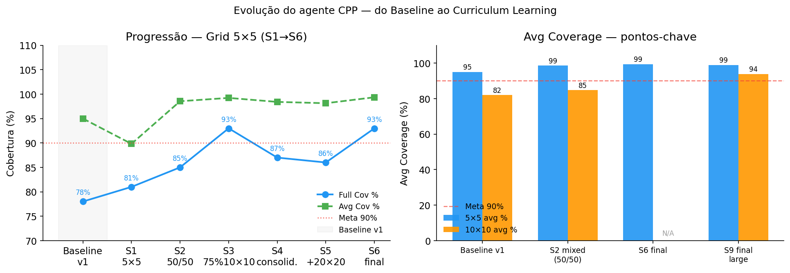

O gráfico esquerdo mostra a evolução no 5×5 ao longo dos stages. O salto mais expressivo ocorre no **S3** (75% 10×10 + alta entropia = ent=0.08): de 85% para 93%. A alta entropia quebra os padrões determinísticos que causavam loops, forçando exploração mais diversa.

| Stage | 5×5 Full% | 5×5 Avg% |
|-------|-----------|----------|
| Baseline v1 | 78% | 95.0% |
| S1 | 81% | 89.82% |
| S2 | 85% | 98.55% |
| **S3** | **93%** | **99.23%** |
| S4 | 87% | 98.41% |
| S5 | 86% | 98.14% |
| **S6** | **93%** | **99.36%** |

### 4.2 Full Coverage Rate — todos os modelos


### 4.3 Distribuição de Steps — S6 em 5×5

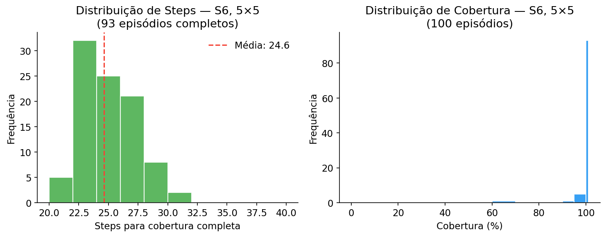

Dos 100 episódios do S6: **93 com cobertura completa** em média de 24.5 steps. Os 7 episódios parciais ainda atingem 91% de cobertura média.

### 4.4 10×10 após S1→S6

O melhor resultado em 10×10 dentro dos stages iniciais foi o **S2** (50/50 mixed): 47% full coverage, 84.76% avg — abaixo da meta de 90% avg. Os stages seguintes priorizavam o 5×5 e não avaliavam o 10×10 continuamente.

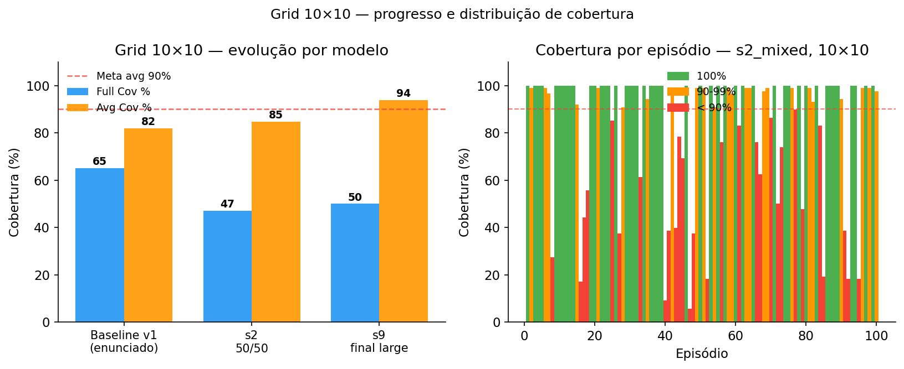

O gráfico direito mostra a instabilidade do S2 no 10×10: muitos episódios falham abaixo de 90%, mas a maioria dos bem-sucedidos atinge 100%. O problema é a inconsistência — o agente ou cobre tudo ou trava cedo.

---

## 5. Resultados — Fase 2: Continuação (S7→S9)

Com o 5×5 consolidado em 93%, o objetivo da segunda fase foi elevar o 10×10 acima de 90% avg e introduzir o 20×20 de forma mais robusta.

Três stages adicionais partindo do modelo S6:

| Stage | Mix de envs | Timesteps | LR | ent | Objetivo |
|-------|------------|-----------|-----|-----|---------|
| S7 | 1×5×5 + 3×10×10 | 5M | 5×10⁻⁵ | 0.07 | Mesma receita do S3, agora para o 10×10 |
| S8 | 1×5×5 + 1×10×10 + 2×20×20 | 5M | 5×10⁻⁵ | 0.05 | Introdução robusta do 20×20 |
| S9 | 1×5×5 + 2×10×10 + 1×20×20 | 2M | 1×10⁻⁵ | 0.02 | Fine-tune final com todos os tamanhos |

**LR reduzido (5×10⁻⁵ ao invés de 1×10⁻⁴)** para proteger o 5×5 enquanto o agente aprende o 10×10 em profundidade. A alta entropia no S7 (ent=0.07) aplica a mesma lógica que funcionou no S3 para o 5×5.

### 5.1 Resultados Finais (S9, inferência determinística)

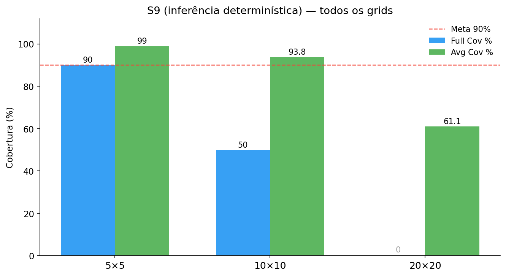

| Grid | Full Cov% | Avg Cov% | Mediana | Steps médios |
|------|-----------|----------|---------|-------------|
| 5×5  | **90%** | **98.95%** | 100% | 42 |
| 10×10 | **50%** | **93.85%** | 99.4% | 303 |
| 20×20 | 0% | 61.08% | 66.9% | 2000 (limite) |

**5×5**: caiu levemente de 93% para 90% full coverage (o foco intenso no 10×10 no S7 moveu levemente a política), mas manteve-se acima da meta de 90% e com avg de 98.95%.

**10×10**: meta atingida — **93.85% de avg coverage**, com mediana de 99.4%. A maioria dos episódios é bem-sucedida; os 50% que não chegam a 100% ainda cobrem quase todo o grid.

**20×20**: 0% full coverage, 61% avg. O agente não consegue cobrir tudo, a princípio sem um motivo aparente.

### 5.2 Agente em ação (3 episódios por grid)

**Grid 5×5** — cobertura completa em ~22 passos:

| Ep 1 (23 passos) | Ep 2 (21 passos) | Ep 3 (23 passos) |
|:-:|:-:|:-:|
| 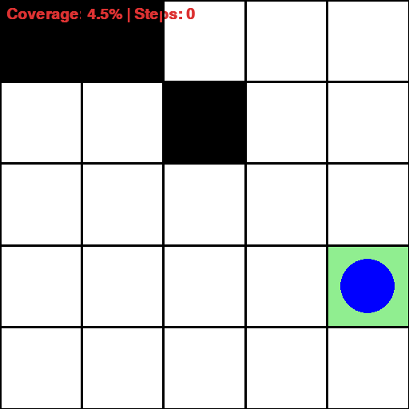 | 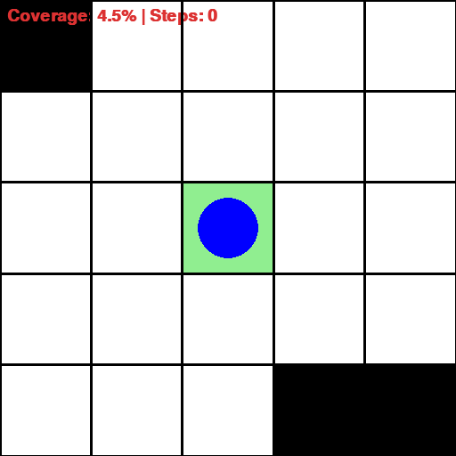 | 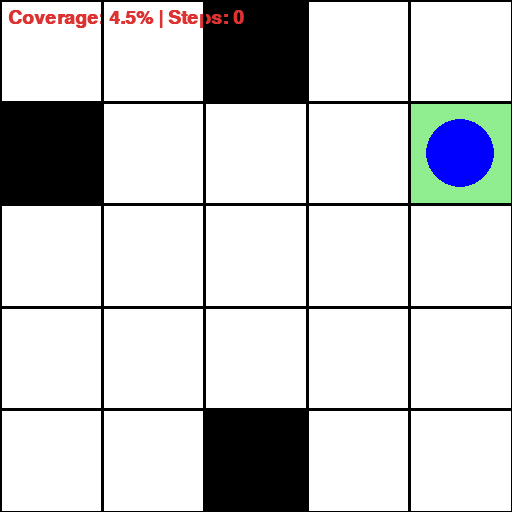 |

**Grid 10×10** — quando completa, faz em ~100 passos:

| Ep 1 (98 passos) | Ep 2 (110 passos) | Ep 3 (109 passos) |
|:-:|:-:|:-:|
| 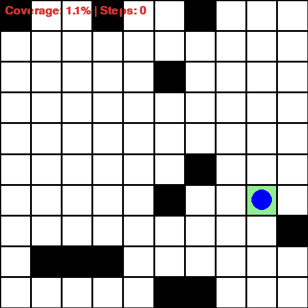 | 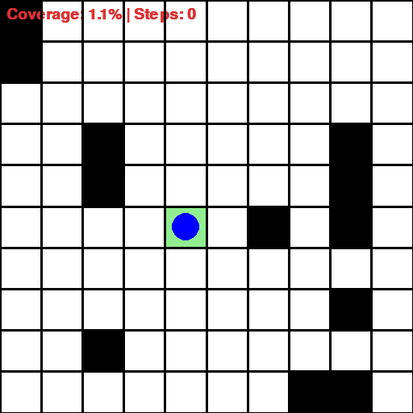 | 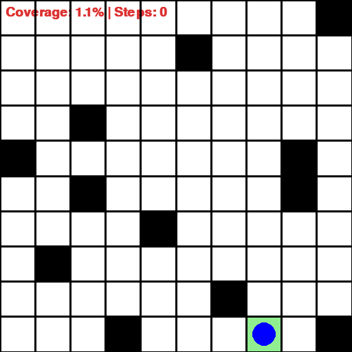 |

**Grid 20×20** — cobre rapidamente >95% mas oscila no fim e estoura o limite de 2000 passos:

| Ep 1 (98.9%) | Ep 2 (97.7%) | Ep 3 (94.6%) |
|:-:|:-:|:-:|
|  | 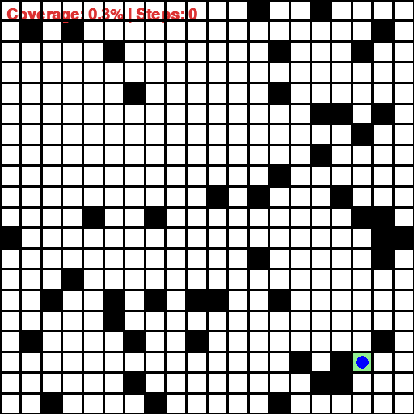 | 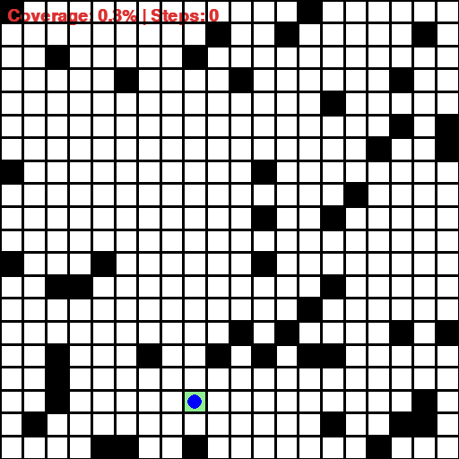 |

---

## 6. Refinamento Final: A Descoberta dos Loops e o Anti-Loop Predictor

### 6.1 O que observamos nos GIFs de 20×20

Olhando os três GIFs do 20×20 acima, um padrão visual ficou óbvio: o agente cobre rapidamente ~95-98% do grid nas primeiras centenas de passos — comportamento competente, em linha com o que se espera da arquitetura — mas perto do fim **começa a oscilar entre duas células vizinhas** e não consegue mais fazer progresso. O contador de steps continua subindo até 2000 sem que a cobertura aumente.

Os números do S9 confirmam o que os olhos viam: 20×20 com 0% full coverage e 61% avg, com **todos os episódios atingindo o limite de 2000 passos**. O agente não estava "perdido" — ele estava preso em loops bem específicos no fim do episódio.

### 6.2 Hipótese: por que o agente entra em loop

O `frontier vector` aponta para a célula livre mais próxima por **distância de Manhattan**, não pelo caminho real. Quando os últimos 1-3% restantes estão atrás de um obstáculo ou em uma região fora da janela 7×7:

- O frontier aponta numa direção (digamos, leste).
- O agente vai para leste e bate na parede / obstáculo.
- O frontier recalcula e agora aponta noutra direção (norte).
- O agente vai para norte e bate em outra parede.
- O frontier volta a apontar para leste...
- E assim por diante.

Como a inferência é determinística (`argmax` dos logits), e o estado observado é praticamente o mesmo a cada visita às mesmas duas células, o agente toma exatamente as mesmas duas ações alternadamente. **Loop perfeito de 2 células.**

### 6.3 Modificação: AntiLoopPredictor (sem re-treino)

Em vez de mudar a arquitetura do agente (exigiria muito tempo de re-treino), foi implementado um wrapper de inferência de ~30 linhas que combina duas ideias simples:

1. **Inferência estocástica** (`deterministic=False`): o agente amostra da distribuição de ações em vez de sempre pegar o argmax. Isso por si só já quebra alguns loops "marginais" onde os logits estavam quase empatados.

2. **Detector explícito de loop de 2 células**: mantém um deque das últimas 8 posições. Se em 8 passos o agente visitou apenas ≤2 células únicas, considera-se em loop e força uma ação amostrada uniformemente entre as **3 direções que não retornam à posição imediatamente anterior**. Quebra o loop sem precisar entender por quê.

Implementação na classe `AntiLoopPredictor` em `train_grid_world_cpp_v2.py:60`, plugada em `_eval`, `test`, `run` e em `generate_gifs.py`. **O modelo S9 não foi re-treinado**.

> **Importante:** isso não viola a observação parcial. O wrapper só consulta as posições do próprio agente (informação que ele mesmo gerou) e amostra uniformemente entre ações — não acessa o mapa global. O agente continua operando sob observação parcial.

### 6.4 Resultado final

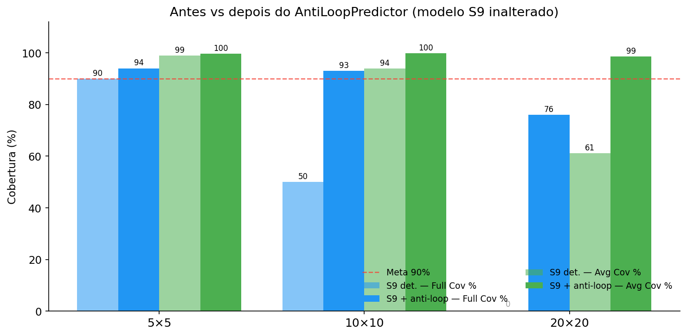

| Grid | Métrica | S9 det. | **S9 + anti-loop** | Δ |
|------|---------|---------|--------------------|---|
| 5×5  | Full%  | 90%    | **94%**           | +4 |
| 5×5  | Avg%   | 98.95% | **99.68%**        | +0.7 |
| 10×10 | Full% | 50%    | **93%**           | **+43** |
| 10×10 | Avg%  | 93.85% | **99.80%**        | +6.0 |
| 20×20 | Full% | 0%     | **76%**           | **+76** |
| 20×20 | Avg%  | 61.08% | **98.58%**        | **+37.5** |

A frequência média de "loop-breaks" acionados por episódio explica o impacto desigual da correção:

- **5×5**: 0.5/ep — quase nunca preciso, o agente raramente trava em grids pequenos.
- **10×10**: 1.8/ep — usado ocasionalmente, suficiente para destravar os 50% de episódios que falhavam.
- **20×20**: **44.3/ep** — constantemente acionado, é o que viabiliza completar o grid.

### 6.5 Mesmos episódios após a correção

Para fechar a história, os mesmos seeds que travavam no 20×20 agora completam dentro do orçamento de 2000 passos (frames subsampleados para 200):

| Ep 1 (100%, 533 passos) | Ep 2 (100%, 775 passos) | Ep 3 (100%, 496 passos) |
|:-:|:-:|:-:|
| 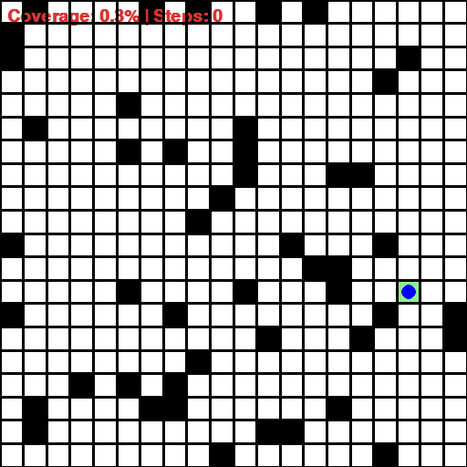 |  |  |

O agente continua passando por momentos curtos de oscilação no fim — visíveis nas pequenas "gaguejadas" — mas o detector quebra cada loop em ~8 passos, e a inferência estocástica impede que ele caia no mesmo loop logo em seguida. O resultado é que os últimos 1-3% que antes consumiam 1500+ passos agora se fecham em algumas dezenas.

---

## 7. Análise

### 7.1 O que funcionou

**Frontier vector** foi o principal responsável pelo salto de qualidade. Dois estados idênticos para o v1 (todas as células vizinhas visitadas) tornam-se distinguíveis no v2:
- Células livres ao norte → `frontier=[0, -0.5, ...]`
- Células livres ao sul → `frontier=[0, +0.5, ...]`

O agente passa a navegar em direção a áreas inexploradas em vez de aleatoriamente.

**Curriculum misto** foi fundamental para evitar o catastrophic forgetting. Misturar grids de tamanhos diferentes no mesmo rollout force a rede a manter comportamentos úteis para todos os contextos simultaneamente.

**Alta entropia nos stages de "quebra de loops"** (S3 para 5×5, S7 para 10×10) foi consistentemente eficaz — forçar exploração durante o treinamento produz políticas mais robustas.

### 7.2 O que limitou o 20×20 (antes do anti-loop)

O gargalo principal é arquitetural: o `MultiInputPolicy` do SB3 aplica um MLP flat sobre o `local_map` 7×7 (49 valores). Uma CNN extrairia features espaciais muito mais ricas — padrões de bordas, corredores, regiões abertas — que o MLP não consegue aprender eficientemente. Para 20×20, o agente precisaria de uma política de planejamento que enxergasse além dos 3 cells cobertos pela janela local.

### 7.3 Lição sobre Catastrophic Forgetting

O experimento sequencial demonstrou empiricamente: fine-tuning puro em 10×10 após o 5×5 destruiu completamente a política (81% → 0%). A solução pelo curriculum misto é mais simples e eficaz do que técnicas de regularização como EWC ou distillation.

---

## 8. Conclusão

| Grid | Baseline v1 | S9 det. | **S9 + anti-loop** |
|------|-------------|---------|--------------------|
| 5×5 Full% | 78% | 90% | **94%** |
| 5×5 Avg% | 95.0% | 98.95% | **99.68%** |
| 10×10 Full% | 65% | 50% | **93%** |
| 10×10 Avg% | 82.0% | 93.85% | **99.80%** |
| 20×20 Full% | — | 0% | **76%** |
| 20×20 Avg% | — | 61.08% | **98.58%** |

A solução final combina quatro ingredientes:

1. **Representação de estado v2** (seen_map + local_map 7×7 + frontier vector) — dá memória espacial e direção explícita para áreas inexploradas
2. **Curriculum learning misto** — treina simultaneamente em múltiplos tamanhos de grid, evita catastrophic forgetting
3. **Inferência estocástica** — quebra empates entre direções de frontier
4. **Anti-loop predictor** — detector de loop de 2 células que força exploração quando o agente trava

Os três primeiros são modificações no agente. O quarto é um wrapper de inferência que custou ~30 linhas e dispensou re-treino, mas foi o que viabilizou cobertura quase-completa no 20×20. A conclusão prática: para problemas de CPP com observação parcial, **a arquitetura MLP do PPO + frontier vector cobre quase tudo, mas precisa de um mecanismo externo de detecção de loop para fechar os 1-3% finais em grids grandes**.
