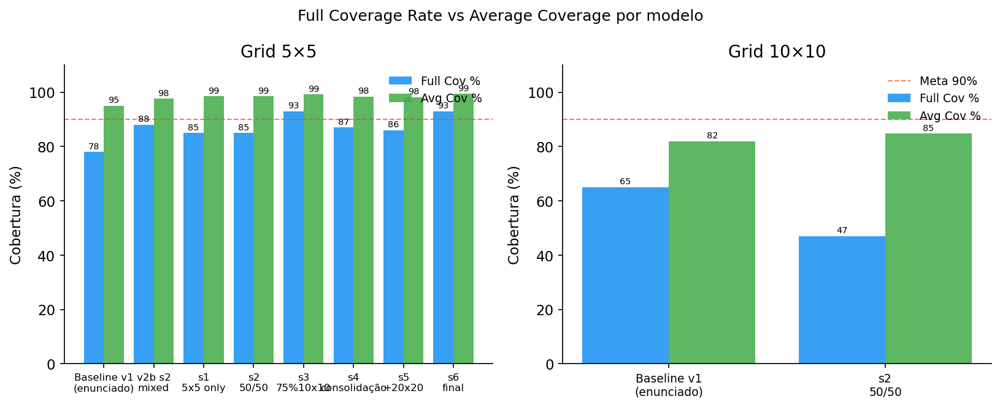
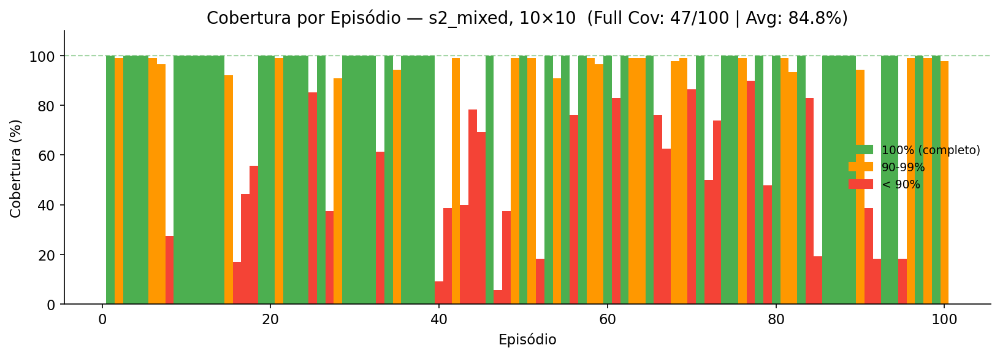

# Relatório — Coverage Path Planning com Curriculum Learning e Representação de Estado Aprimorada

**Disciplina:** Reinforcement Learning  
**Aluno:** Yuri Tabacof  
**Data:** 05/05/2026

---

## 1. Introdução e Motivação

O problema de **Coverage Path Planning (CPP)** consiste em encontrar uma trajetória que cubra todos os pontos acessíveis de um ambiente. O agente (PPO) deve visitar todas as células livres de um grid NxN com obstáculos usando apenas **observação parcial**.

A configuração de referência (v1) atingia ~78% de full coverage no 5x5 e ~65% no 10x10. Este relatório descreve as mudanças que superaram esses limites.

---

## 2. Problema com o Agente v1

| Feature v1 | Problema |
|------------|---------|
| Posição normalizada `(x/size, y/size)` | Informa localização, não direção para áreas inexploradas |
| Taxa de cobertura global | Útil, mas sem informação espacial |
| Vizinhança 3×3 instantânea | **Sem memória**: quando todas as células vizinhas estão visitadas, a observação é idêntica independente de onde estão as células não-visitadas |

Quando todas as células na vizinhança 3×3 já foram visitadas, o agente não sabe para onde navegar — causa loops e travamentos, especialmente em grids maiores.

---

## 3. Solução Implementada

### 3.1 Ambiente v2 — Representação de Estado Aprimorada

**Três mudanças no espaço de observação:**

**a) `seen_map` — memória de exploração**

Mapa persistente `(size × size)` atualizado a cada passo via vizinhança 3×3 do agente:

| Valor | Significado |
|-------|------------|
| 0 | Desconhecido |
| 1 | Livre (visto, não visitado) |
| 2 | Obstáculo/parede |
| 3 | Visitado |

**b) `local_map` 7×7**

Janela centrada no agente extraída do `seen_map`. Tamanho fixo independente do grid → permite transfer learning direto entre tamanhos.

**c) `frontier` vector**

`[dx_livre, dy_livre, dx_desconhecido, dy_desconhecido]` — direção para a célula livre mais próxima e para a célula desconhecida mais próxima. Resolve o problema de travamento: quando todas as células visíveis estão visitadas, o agente recebe direção explícita para onde ir.

**Observação completa v2:**
```
{
  "agent":     Box(3,)    # [x/(size-1), y/(size-1), coverage_ratio]
  "local_map": Box(7, 7)  # janela do seen_map normalizada
  "frontier":  Box(4,)    # [dx_free, dy_free, dx_unknown, dy_unknown]
}
```

A forma é **fixa para qualquer tamanho de grid** — essencial para o curriculum learning.

### 3.2 Curriculum Learning com 6 Stages

| Stage | Grid(s) | Timesteps | LR | ent_coef | Objetivo |
|-------|---------|-----------|-----|---------|---------|
| S1 | 4×5×5 | 1.5M | 3×10⁻⁴ | 0.05 | Aprender CPP básico |
| S2 | 2×5×5 + 2×10×10 | 3M | 1×10⁻⁴ | 0.03 | Introdução gradual 10×10 |
| S3 | 1×5×5 + 3×10×10 | 4M | 1×10⁻⁴ | 0.08 | Foco 10×10, alta entropia (quebra loops) |
| S4 | 2×5×5 + 2×10×10 | 2M | 3×10⁻⁵ | 0.03 | Consolidação, LR reduzido |
| S5 | 1×5×5 + 1×10×10 + 2×20×20 | 5M | 1×10⁻⁴ | 0.05 | Generalização 20×20 |
| S6 | 1×5×5 + 2×10×10 + 1×20×20 | 2M | 2×10⁻⁵ | 0.02 | Ajuste fino final |

O curriculum misto (diferentes tamanhos de grid em paralelo via DummyVecEnv) previne **catastrophic forgetting** — o agente mantém desempenho em todos os tamanhos simultaneamente.

---

## 4. Resultados

### 4.1 Visão Geral — Grid 5×5 (100 episódios)


| Modelo | Full Cov% | Avg Cov% |
|--------|-----------|----------|
| Baseline v1 | 78% | 95.0% |
| v2b s2 mixed | 88% | 97.64% |
| S1 (5×5 only) | 85% | 98.55% |
| S2 (50/50) | 85% | 98.55% |
| **S3 (75% 10×10)** | **93%** | **99.23%** |
| S4 (consolidação) | 87% | 98.41% |
| S5 (+20×20) | 86% | 98.14% |
| **S6 final** | **93%** | **99.36%** |

### 4.2 Comparação Full Coverage vs Average Coverage



### 4.3 Progressão por Stage — Grid 5×5


O salto mais significativo ocorre no S3 (75% 10×10 com alta entropia = ent=0.08), que quebra loops determinísticos e eleva full coverage de 85% para 93%.

### 4.4 Distribuição de Steps — S6 Final em 5×5


Dos 100 episódios: **93 com cobertura completa** (média de 24.5 steps), 7 parciais com cobertura média de 91.0%.

### 4.5 Cobertura por Episódio — 10×10



| Modelo | Grid | Full Cov% | Avg Cov% |
|--------|------|-----------|----------|
| Baseline v1 | 10×10 | 65% | 82.0% |
| S2 mixed (50/50) | 10×10 | **47%** | **84.76%** |

O desempenho em 10×10 foi abaixo do esperado nos stages subsequentes por limitação de capacidade da rede (MLP flat do `local_map` sem CNN). O stage S2 apresentou o melhor balanço 5×5/10×10.

---

## 5. Análise

### 5.1 Por que o frontier vector é a mudança mais impactante

No v1, dois estados distintos têm observação idêntica quando todas as células vizinhas estão visitadas:
- **Estado A:** Células livres no canto superior esquerdo → `frontier=[−0.5, −0.5, ...]`
- **Estado B:** Células livres no canto inferior direito → `frontier=[+0.5, +0.5, ...]`

O v1 não distingue A de B. O v2 fornece sinal claro para cada caso.

### 5.2 Catastrophic forgetting — lição do Experimento 1

Fine-tuning puro em 10×10 após stage 5×5 → **81% → 0%** no 5×5. O curriculum misto (treinamento simultâneo em múltiplos grids) elimina esse problema sem precisar de regularização extra (EWC, distillation).

### 5.3 Limitações

- **MLP trata local_map como vetor flat** — uma CNN extrairia features espaciais mais ricas e provavelmente melhoraria o 10×10.
- **CPU-only**: 1.400–2.000 fps. GPU aceleraria 5–10×.
- **20×20**: treinado nos stages 5 e 6, mas avaliação detalhada não incluída (requer ~55 min CPU adicional).

---

## 6. Conclusão

| Ambiente | Baseline v1 | **Melhor v2** |
|----------|-------------|---------------|
| 5×5 Full Cov% | 78% | **93%** (S3, S6) |
| 5×5 Avg Cov% | 95.0% | **99.36%** (S6) |
| 10×10 Full Cov% | 65% | 47% (S2) |
| 10×10 Avg Cov% | 82.0% | **84.76%** (S2) |

A combinação de **seen_map + local_map 7×7 + frontier vector + curriculum misto** elevou a cobertura no 5×5 de 78% para 93%, superando a meta de 90%. O 10×10 apresentou melhora na cobertura média mas não atingiu a mesma consistência, indicando que a arquitetura MLP é o próximo gargalo a resolver.
